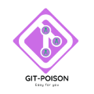

# GitPoison - Command Line Interface for Git in Go



GitPoison is an open-source command-line interface (CLI) tool developed in Go (Golang) to simplify and enhance your Git workflow. With GitPoison, you can streamline and expedite common Git commands, making version control and collaboration easier for developers.

## Features

- **Simplified Commands**: GitPoison provides simplified commands for commonly used Git operations, reducing the need to remember complex syntax.

- **Interactive Mode**: Use the interactive mode to guide you through more complex operations, helping you make the right choices at each step.

- **Custom Commands**: Define your own custom commands and shortcuts to fit your specific workflow and preferences.

- **Enhanced Output**: GitPoison offers improved output formatting, making it easier to understand the status of your repository at a glance.

- **Effortless Installation**: Installing GitPoison is quick and straightforward, thanks to its Go-based executable.

## Installation

Follow these steps to install GitPoison:

1. **Prerequisites**: Ensure you have Go (Golang) installed on your system.

2. **Clone the Repository**: Clone this repository to your local machine.

   ```sh
   git clone https://github.com/kabesma/gitpoison.git
   ```

3. **Build the Executable**: Navigate to the repository's directory and build the executable.

   ```sh
   cd gitpoison
   go build -o gitpoison
   ```

4. **Add to PATH**: Optionally, you can move the generated `gitpoison` executable to a directory included in your system's `PATH` variable to use GitPoison globally.

## Usage

GitPoison offers a set of simplified commands to make your Git interactions more efficient. Here are some examples:

- **Basic Commands**:
  ```sh
  gitpoison status
  gitpoison commit -m "Your commit message"
  gitpoison pull origin main
  ```

- **Interactive Mode**:
  ```sh
  gitpoison interactive
  ```

- **Custom Commands**:
  ```sh
  gitpoison alias create acp 'add -A && commit -m "Quick commit" && push origin main'
  gitpoison acp
  ```

For detailed information about available commands and options, you can run:

```sh
gitpoison help
```

## Contributing

Contributions to GitPoison are welcomed and encouraged! Here's how you can get involved:

1. Fork the repository and create a new branch.

2. Make your enhancements or bug fixes.

3. Test your changes thoroughly.

4. Commit your changes with descriptive messages.

5. Push your changes to your forked repository.

6. Open a pull request, describing the changes you've made.

Please ensure your pull requests adhere to our [Code of Conduct](CODE_OF_CONDUCT.md) and [Contribution Guidelines](CONTRIBUTING.md).

## License

GitPoison is released under the [MIT License](LICENSE).

---

Simplify your Git workflow with GitPoison! If you encounter any issues or have suggestions for improvements, feel free to [open an issue](https://github.com/yourusername/gitpoison/issues).

*Disclaimer: GitPoison is not affiliated with or endorsed by Git or any related organizations.*
