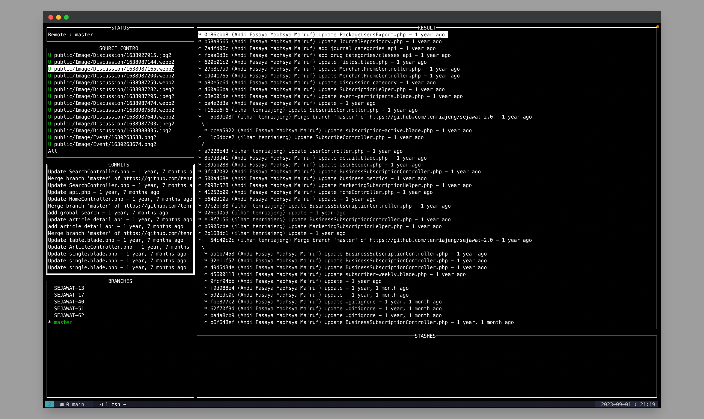

# GitPoison - Command Line Interface for Git in Go

  

## Description
This is a project that is currently under development. The project is aimed at makes it easier for developers to use Simple Git.

## Status
This project is currently in the development phase. We are working diligently to implement the planned features.

## Planned Features
- [x] Show Basic Command Git. (git log, git branch)
- [x] git add
- [x] git restore
- [x] git stash save
- [ ] git commit
- [ ] git stash pop
- [ ] Etc...

## Technologies Used
- [Golang](https://go.dev/): Go Language
- [Tview](https://github.com/rivo/tview): Terminal UI library with rich, interactive widgets.

## Contribution
We are very open to contributions from the community. If you'd like to contribute, you can open an issue to let us know about the changes you're planning, or you can submit a pull request.

## How to Run the Project
1. Pull Request main
2. go run main

Make sure you have the [required prerequisites](#) before running the project.

## Further Do
You can find the complete documentation at [project documentation](#).

## Contact
If you have any questions or further feedback, you can reach out to us via [email](info@kabesma.org) or through social media: [Twitter](#), [Facebook](https://www.facebook.com/kabesma.org).

## Donation
Please Support US on [GitPoison](https://invoice.xendit.co/donation/poison).

---

Please note that this project is still actively under development, and some information above might change as the development progresses. We appreciate your interest and support!

